Latihan 1

Penggunaan end

Parameter akhir dalam fungsi cetak digunakan untuk menambahkan string apa pun. Di akhir output dari pernyataan print dengan python. Secara default, fungsi cetak diakhiri dengan baris baru. Melewati spasi putih ke parameter akhir (end=' ') menunjukkan bahwa karakter akhir harus diidentifikasi oleh spasi putih dan bukan baris baru.

print('A', end='')
print('B', end='')
print('C', end='')
print()
print('X')
print('Y')
print('Z')
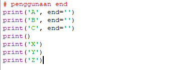

tring Format

String Formatting atau Pemformatan string memungkinkan kita menyuntikkan item ke dalam string daripada kita mencoba menggabungkan string menggunakan koma atau string concatenation.

# string format

print(0, 10**0)
print(1, 10**1)
print(2, 10**2)
print(3, 10**3)
print(4, 10**4)
print(5, 10**5)
print(6, 10**6)
print(7, 10**7)
print(8, 10**8)
print(9, 10**9)
print(10, 10**10)
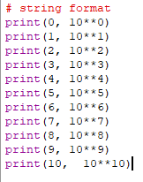

String Format 2

print('{0:>3} {1:>16}'.format(0, 10**0))
print('{0:>3} {1:>16}'.format(0, 10**1))
print('{0:>3} {1:>16}'.format(0, 10**2))
print('{0:>3} {1:>16}'.format(0, 10**3))
print('{0:>3} {1:>16}'.format(0, 10**4))
print('{0:>3} {1:>16}'.format(0, 10**5))
print('{0:>3} {1:>16}'.format(0, 10**6))
print('{0:>3} {1:>16}'.format(0, 10**7))
print('{0:>3} {1:>16}'.format(0, 10**8))
print('{0:>3} {1:>16}'.format(0, 10**9))
print('{0:>3} {1:>16}'.format(0, 10**10))
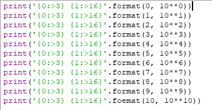

Hasil Latihan 1

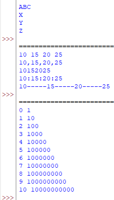

Latihan 2

Input Variable

Penggunaan python untuk menginput nilai variabel dengan cara

a=input("masukkan nilai a:")
b=input("masukkan nilai b:")
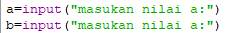

Cetak Variable

Mencetak nilai kedua variabel ketika sudah di input

print("variable a=",a)
print("variable b=",b)
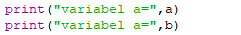

Penggabungan Variable

Penggabungan kedua nilai Variable

print("hasil penggabungan {1}&{0}=%s".format(a,b) %(a+b))
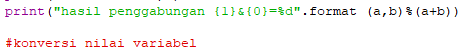

Input Variable 2

Penggunaan python untuk menginput kedua variable

a=int(a)
b=int(b)
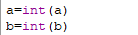

Konversi Nilai Variable

Mencetak kembali hasil mengkonversi nilai kedua variabel

print("hasil penjumlahan {1}+{0}=%d".format(a,b) %(a+b))
print("hasil pembagian {1}+{0}=%d".format(a,b) %(a/b))
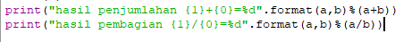

Hasil Latihan 2

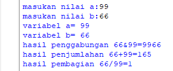

Latihan 3 

Menggunakan String Format untuk membuat Belah Ketupat
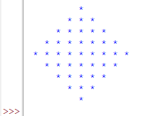

Latihan 4

Luas dan Keliling Lingkaran

Flowchart untuk mencari luas dan keliling lingkaran

Praktikum 3

hasil praktikum 3 yang telah saya lakukan yaitu:

- dapat memahami algortima lingkaran yang diproses dalam python
- dapat menjelaskan bagaimana langkah-langkah membuat algoritma lingkaran pada python
- dapat membuat flowchart algoritma dengan baik dan benar
- dapat mengoperasikan langsung algoritma lingkaran pada python
- 

